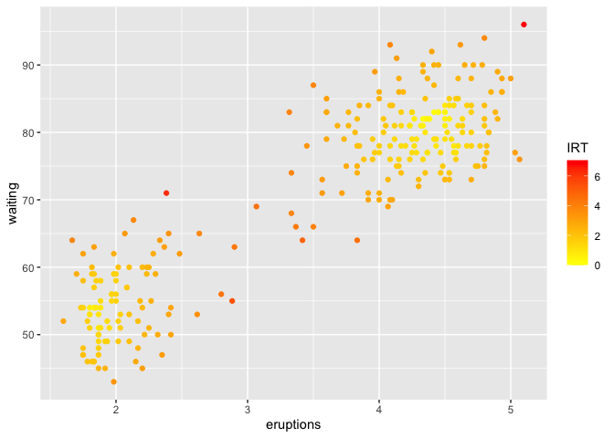

<!-- README.md is generated from README.Rmd. Please edit that file -->

# outlierensembles


<!-- badges: start -->
[](https://github.com/sevvandi/outlierensembles/actions/workflows/R-CMD-check.yaml)
<!-- badges: end -->

**outlierensembles** provides a collection of outlier/anomaly detection
ensembles. Given the anomaly scores of different anomaly detection
methods, the following ensemble techniques can be used to construct an
ensemble score:

1.  Item Response Theory based ensemble discussed in Kandanaarachchi
    (2022)
2.  Greedy ensemble discussed in Schubert et al. (2012)
3.  Inverse Cluster Weighted Averaging (ICWA) method discussed in Chiang
    (2017)
4.  Using Maximum scores discussed in Aggarwal and Sathe (2015)
5.  Using a threshold sum discussed in Aggarwal and Sathe (2015)
6.  Using the mean as the ensemble score

## Installation

You can install the released version of outlierensembles from
[CRAN](https://CRAN.R-project.org) with:

``` r
install.packages("outlierensembles")
```

And the development version from [GitHub](https://github.com/) with:

``` r
# install.packages("devtools")
devtools::install_github("sevvandi/outlierensembles")
```

## Example

We use methods from dbscan R package as to find anomalies. You can use
any anomaly detection method you want to build the ensemble. First, we
construct the IRT ensemble. The colors show the ensemble scores.

``` r
faithfulu <- scale(faithful)
# Using different parameters of lof for anomaly detection
y1 <- dbscan::lof(faithfulu, minPts = 5)
y2 <- dbscan::lof(faithfulu, minPts = 10)
y3 <- dbscan::lof(faithfulu, minPts = 20)
knnobj <- dbscan::kNN(faithfulu, k = 20)
# Using different KNN distances as anomaly scores
y4 <- knnobj$dist[ ,5]
y5 <- knnobj$dist[ ,10]
y6 <- knnobj$dist[ ,20]
# Dense points are less anomalous. Points in less dense areas are more anomalous. Hence 1 - pointdensity is used.
y7 <- 1 - dbscan::pointdensity(faithfulu, eps = 1, type="gaussian")
y8 <- 1 - dbscan::pointdensity(faithfulu, eps = 2, type = "gaussian")
y9 <- 1 - dbscan::pointdensity(faithfulu, eps = 0.5, type = "gaussian")


Y <- cbind.data.frame(y1, y2, y3, y4, y5, y6, y7, y8, y9)
ens1 <- irt_ensemble(Y)
#> Warning in sqrt(diag(solve(Hess))): NaNs produced
df <- cbind.data.frame(faithful, ens1$scores)
colnames(df)[3] <- "IRT"
ggplot(df, aes(eruptions, waiting)) + geom_point(aes(color=IRT))  +  scale_color_gradient(low="yellow", high="red") 
```



Then we do the greedy ensemble.

``` r
ens2 <- greedy_ensemble(Y)
df <- cbind.data.frame(faithful, ens2$scores)
colnames(df)[3] <- "Greedy"
ggplot(df, aes(eruptions, waiting)) + geom_point(aes(color=Greedy)) +  scale_color_gradient(low="yellow", high="red") 
```


We do the ICWA ensemble next.

``` r
ens3 <- icwa_ensemble(Y)
df <- cbind.data.frame(faithful, ens3)
colnames(df)[3] <- "ICWA"
ggplot(df, aes(eruptions, waiting)) + geom_point(aes(color=ICWA)) +  scale_color_gradient(low="yellow", high="red") 
```


Next, we use the maximum scores to build the ensemble.

``` r
ens4 <- max_ensemble(Y)
df <- cbind.data.frame(faithful, ens4)
colnames(df)[3] <- "Max"
ggplot(df, aes(eruptions, waiting)) + geom_point(aes(color=Max)) +  scale_color_gradient(low="yellow", high="red") 
```


Then, we use the a threshold sum to construct the ensemble.

``` r
ens5 <- threshold_ensemble(Y)
df <- cbind.data.frame(faithful, ens5)
colnames(df)[3] <- "Threshold"
ggplot(df, aes(eruptions, waiting)) + geom_point(aes(color=Threshold)) +  scale_color_gradient(low="yellow", high="red") 
```


Finally, we use the mean values as the ensemble score.

``` r
ens6 <- average_ensemble(Y)
df <- cbind.data.frame(faithful, ens6)
colnames(df)[3] <- "Average"
ggplot(df, aes(eruptions, waiting)) + geom_point(aes(color=Average)) +  scale_color_gradient(low="yellow", high="red") 
```


## References

<div id="refs" class="references csl-bib-body hanging-indent"
entry-spacing="0">

<div id="ref-Aggarwal2015" class="csl-entry">

Aggarwal, Charu C., and Saket Sathe. 2015.
“<span class="nocase">Theoretical Foundations and Algorithms for Outlier
Ensembles</span>.” *ACM SIGKDD Explorations Newsletter* 17 (1): 24–47.
<https://doi.org/10.1145/2830544.2830549>.

</div>

<div id="ref-Chiang2017" class="csl-entry">

Chiang, Alvin et al. 2017. “<span class="nocase">A study on anomaly
detection ensembles</span>.” *Journal of Applied Logic* 21: 1–13.
<https://doi.org/10.1016/j.jal.2016.12.002>.

</div>

<div id="ref-kandanaarachchiirtensemble" class="csl-entry">

Kandanaarachchi, Sevvandi. 2022. “Unsupervised Anomaly Detection
Ensembles Using Item Response Theory.” *Information Sciences* 587:
142–63. https://doi.org/<https://doi.org/10.1016/j.ins.2021.12.042>.

</div>

<div id="ref-Schubert2012" class="csl-entry">

Schubert, Erich, Remigius Wojdanowski, Arthur Zimek, and Hans Peter
Kriegel. 2012. “<span class="nocase">On evaluation of outlier rankings
and outlier scores</span>.” In *Proceedings of the 12th SIAM
International Conference on Data Mining, SDM 2012*, 1047–58.

</div>

</div>
